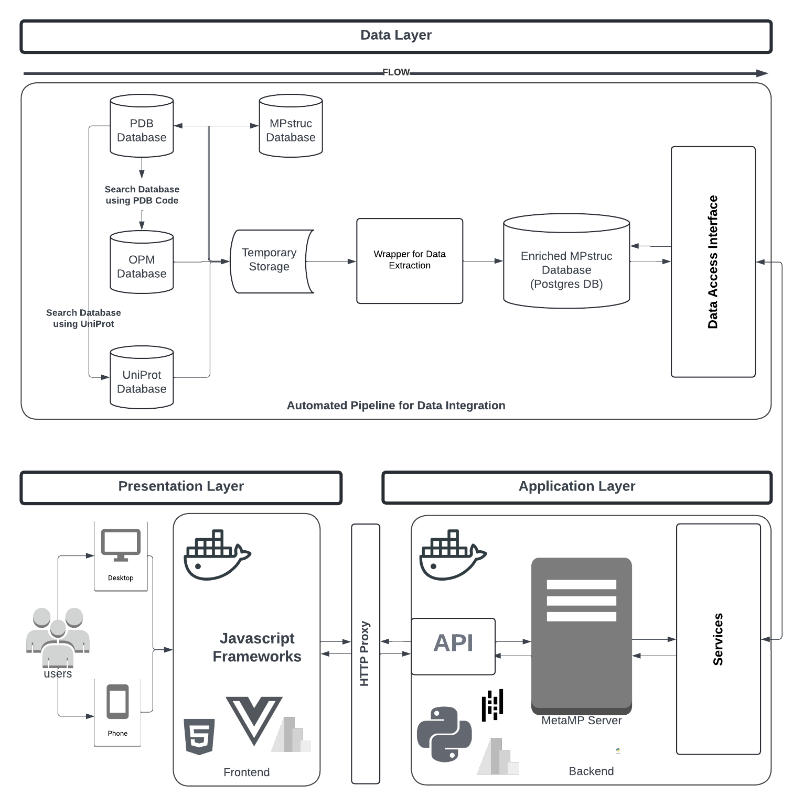

# MetaMP Application

MetaMP is a web application designed to dynamically curate structure determination metadata for resolved Membrane Proteins (MPs). It provides several interactive views to explore enriched MP structure data and associated metadata, supporting advanced analysis and data-driven decision-making.

## Table of Contents

1. [About the Project](#about-the-project)
2. [Key Features](#key-features)
3. [Built With](#built-with)
4. [Requirements](#requirements)
5. [Environment Setup](#environment-setup)
6. [Installation](#installation)
7. [Project Folder Structure](#project-folder-structure)
8. [Application Setup and Configuration](#application-setup-and-configuration)
9. [Seeding Process](#seeding-process)
10. [Running the Application](#running-the-application)
    - [Running with Flask Development Server](#running-with-flask-development-server)
    - [Running with Gunicorn (macOS/Linux)](#running-with-gunicorn-macoslinux)
    - [Running with Waitress (Windows)](#running-with-waitress-windows)
11. [Using Docker](#using-docker)
12. [Flask Database Commands](#flask-database-commands)
13. [Working with Redis](#working-with-redis)
14. [Working with RabbitMQ](#working-with-rabbitmq)
15. [Performance Considerations](#performance-considerations)
16. [Data Availability Statement](data-availability-statement)
17. [License](#license)
18. [Contact](#contact)
19. [Acknowledgments](#acknowledgments)

## About the Project

**MetaMP** allows users to visualize, analyze, and curate MP structure metadata through various interactive views. These views provide insights into MP structures resolved by different experimental methods, discrepancies in data across databases, outlier detection, and more. The application is modular, with each component having its own route, view, service, and model files.




## Key Features

### 1. Overview View
Provides high-level visualizations of MP structures, categorized by experimental methods, taxonomic domains, and groups. It includes interactive charts for exploring trends such as the cumulative sum of resolved MP structures over time.

### 2. Summary Statistics View
Offers an on-demand analysis of MP structure metadata. A bar chart displays the cumulative sum of resolved structures by experimental method, with a table showing detailed data points. Users can dynamically filter data by various attributes, such as molecular type, resolution, or growth method, to update the visualization and table.

### 3. Data Discrepancy View
Identifies and displays discrepancies between database entries for MP structures. It provides a line chart to visualize discrepancies over time and a detailed table for inspecting metadata differences. A form is available for users to provide feedback to resolve discrepancies.

### 4. Outlier Detection View
Focuses on detecting outliers in MP structure data using Principal Component Analysis (PCA) and DBSCAN clustering. It includes a whisker plot and Scatter Plot Matrix (SPLOM) for analyzing outliers and understanding data variability. This view enables users to interactively examine anomalies for further investigation or correction.

### 5. Database View
Features a customizable tabular interface for exploring the enriched MetaMP database. Users can filter, sort, and export data based on criteria such as taxonomic domain, experimental method, and resolution. This view facilitates detailed analysis, comparison, and reporting.

### 6. Exploration View
Supports interactive exploration of MP structure data through a dynamic dashboard with customizable filters and visualization options. Users can analyze relationships between attributes like molecular type and experimental method to identify patterns and generate insights.

### 7. Grouping View
Utilizes AI to suggest categorizations of MP structures into predefined groups based on attributes. Experts review and refine these AI-generated groupings to ensure accuracy, enabling efficient and nuanced data curation.

## Built With

<!-- - **Python**: Programming language used for backend development. -->
- **Flask**: Web framework used for creating the server-side application.
- **Docker**: Containerization platform for easy deployment.
- **Redis**: In-memory data structure store for caching.
- **RabbitMQ**: Message-broker software for handling asynchronous tasks.

## Requirements

- Python 3.9+
- Flask 2.0+
- Docker
- Redis
- RabbitMQ
- PostgreSQL or MySQL (depending on your database choice)

## Environment Setup

To set up the development environment, follow these steps:

1. Install Python (3.8 or higher) from the [official Python website](https://www.python.org/).
2. Install Docker and Docker Compose from the [official Docker website](https://www.docker.com/).
3. Install Redis and RabbitMQ on your local machine or use Docker images.
4. Set up a virtual environment:
   ```bash
   python -m venv venv_metamp
   source venv_metamp/bin/activate  # On Windows use `venv_metamp\Scripts\activate`
   ```
5. Install required Python libraries:
    ```bash
    pip install -r requirements.txt
    ```

## Installation

Step 1: Clone the repository
    ```bash
    git clone https://github.com/Ebenco36/MPVIS-V2.git
    cd MetaMP
    ```

Step 2: Install Dependencies
    ```bash
    pip install -r requirements.txt
    ```

Step 3: Configure Environment Variables
    Copy .env content from our example env.
    ```bash
    cp env_example .env
    ```

## Project Folder Structure
```bash
/MetaMP
|-- /airflow        # Save logs for airflow
|-- /airflow_home   # Dag implementations are saved here
|-- /airflowConfig  # Airflow configuration
|-- /config         # Here is where we have different environment configuration
|-- /database       # Database connection class is implemented here
|-- /datasets and datasets_test     # A directory for processed datasets
|-- /logs           # Save application logs
|-- /migrations     # MetaMP migration folder
|-- /models         # machine learning models are saved here
|-- /nginx          # Nginx configuration for docker container is here
|-- /public         # Public saves image and other static content
|-- /serveConfig    # This folder contains files required for docker container to start properly
|-- /src            # MetaMP implementations are here
    |-- /app (Module)
    |   |-- /routes       # Flask route files for each view
    |   |-- /views        # HTML and Jinja templates for views
    |   |-- /services     # Business logic and service files
    |   |-- /models       # Database models
|-- /tests          # test are written here
|-- /utils          # MetaMP utils
|-- Dockerfile        # Docker configuration
|-- docker-compose.yml        # Docker configuration
|-- docker-compose.yml # Docker Compose file for multi-container setup
|-- README.md         # Documentation file
|-- requirements.txt  # Python dependencies
|-- env_example      # Example environment configuration
|-- /manage.py, app.py and server.py # Server implementation
```

## Application Setup and Configuration

1. Configure the .env file with your database and other settings.
2. Run migrations and seed to set up the database schema:
    ```bash
    flask sync-protein-database
    ```
## Running the Application

### Running with Flask Development Server
To run the application using Flask's development server:
    ```bash
    python manage.py runserver
    ```
### Running with Gunicorn (macOS/Linux)
To run the application using Gunicorn:
    ```bash
    gunicorn -w 4 --graceful-timeout 30 -k gevent -b 0.0.0.0:5400 --reload server:app
    ```
### Running with Waitress (Windows)
To run the application using Waitress:
    ```bash
    waitress-serve --port=5000 app:app
    ```
## Using Docker
1. Build the Docker image:
    ```bash
    docker build -t mpvis .
    ```
2. Start the application using Docker Compose:
    ```bash
    docker-compose -f docker2-compose.yml up -d
    ```
3. Free up space by pruning Docker system:
    ```bash
    docker system prune -a
    ```
## Flask Database Commands
1. flask db init: Initialize the database.
2. flask db migrate: Create a new migration.
3. flask db upgrade: Apply migrations.
4. flask db downgrade: Revert migrations.


## Working with Redis

1. Start Redis:
    ```bash
    brew services start redis
    ```
2. Check Redis service status:
    ```bash
    brew services info redis
    ```
3. Stop Redis:
    ```bash
    brew services stop redis
    ```
4. Connect to Redis CLI:
    ```bash
    redis-cli
    ```
## Working with RabbitMQ

1. Start RabbitMQ service:
    ```bash
    brew services start rabbitmq
    ```
2. If you do not need a background service, run:
    ```bash
    CONF_ENV_FILE="/opt/homebrew/etc/rabbitmq/rabbitmq-env.conf" /opt/homebrew/opt/rabbitmq/sbin/rabbitmq-server
    ```
## Performance Considerations
To optimize the performance of MetaMP:

1. Use Redis for caching frequently accessed data.
2. Utilize RabbitMQ for handling asynchronous tasks.
3. Optimize database queries and use indexes where necessary.
4. Use connection pooling and load balancing for handling high traffic.


## Data Availability Statement

The data supporting the findings of this manuscript are derived from publicly available databases widely used in membrane protein research. These sources include:

- **MPstruc**: http://blanco.biomol.uci.edu/mpstruc/
- **OPM (Orientations of Proteins in Membranes)**: https://opm.phar.umich.edu/
- **PDB (Protein Data Bank)**: https://www.rcsb.org/
- **UniProt**: https://www.uniprot.org/uniprotkb

These datasets provide detailed information on membrane protein structures and related characteristics. All data are publicly accessible and do not contain sensitive or personally identifiable information.

The aggregated and processed data used in this study will be made available upon reasonable request to the corresponding author. Requests must include details about the intended use of the data. For further inquiries or access requests, please contact the corresponding author.

## License
Distributed under the MIT License. See LICENSE for more information.


## Contact
ebenco94@gmail.com, georgeshattab@gmail.com


## Acknowledgments
1. Flask for the web framework.
2. Docker for containerization.
3. Redis for caching.
4. RabbitMQ for message brokering.