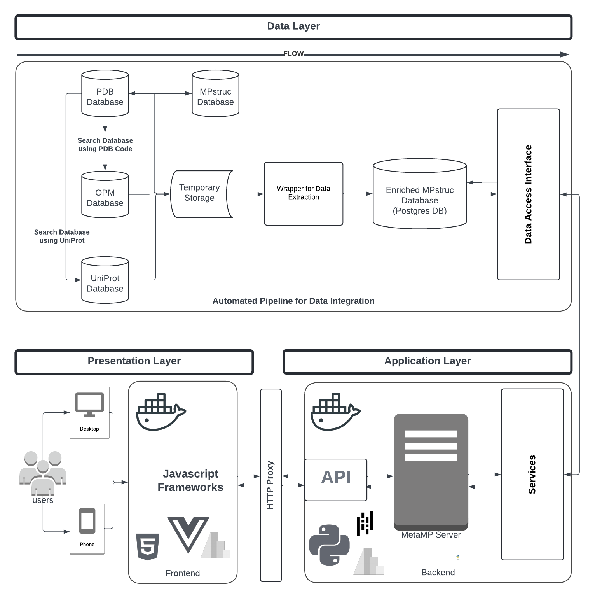

# MetaMP Application

MetaMP is a web application designed to dynamically curate structure determination metadata for resolved Membrane Proteins (MPs). It provides several interactive views to explore enriched MP structure data and associated metadata, supporting advanced analysis and data-driven decision-making.

MetaMP is best understood as a membrane-protein reconciliation and benchmarking platform, not just another viewer. Its main contribution is that it makes disagreements across MPstruc, PDB, OPM, UniProt, expert labels, and topology predictors explicit, reviewable, and exportable in one environment. In practice, that means MetaMP helps users see where membrane-protein annotation is stable, where it is ambiguous, and where expert review is most valuable.

## Table of Contents

1. [About the Project](#about-the-project)
2. [Fastest Start](#fastest-start)
3. [Abstract](#abstract)
4. [Key Features](#key-features)
5. [Built On](#built-on)
6. [Requirements](#requirements)
7. [Jupyter Notebook Test](#jupyter-notebook-test)
8. [Getting started](#getting-started)
9. [Installation and Running](#installation-and-running)
10. [Project Folder Structure](#project-folder-structure)
11. [Application Setup and Configuration](#application-setup-and-configuration)
12. [Seeding Process](#seeding-process)
13. [Running the Application](#running-the-application)
    - [Running with Flask Development Server](#running-with-flask-development-server)
    - [Running with Gunicorn (macOS/Linux)](#running-with-gunicorn-macoslinux)
    - [Running with Waitress (Windows)](#running-with-waitress-windows)
14. [Using Docker](#using-docker)
15. [Flask Database Commands](#flask-database-commands)
16. [Working with Redis](#working-with-redis)
17. [Production Validation](#production-validation)
18. [Performance Considerations](#performance-considerations)
19. [Data Availability Statement](#data-availability-statement)
20. [License](#license)
21. [Contact](#contact)
22. [Acknowledgments](#acknowledgments)
23. [Command Reference](#command-reference)

## About the Project

**MetaMP** allows users to visualize, analyze, and curate MP structure metadata through various interactive views. These views provide insights into MP structures resolved by different experimental methods, discrepancies in data across databases, outlier detection, and more. The application is modular, with each component having its own route, view, service, and model files.

## Why MetaMP Matters

MetaMP contributes to the field in four connected ways:

- it harmonizes membrane-protein annotations from MPstruc, PDB, OPM, and UniProt without hiding source disagreement
- it supports expert-in-the-loop reconciliation by exposing conflicts in group labels, TM counts, TM boundaries, and identifier history
- it provides a reproducible benchmarking layer for assistive ML and topology-prediction comparison
- it packages these capabilities into a usable web platform rather than leaving them as disconnected scripts and tables

What is new here is not simply that multiple databases are displayed together. The relevant contribution is the combination of provenance-aware harmonization, discrepancy review, benchmark suitability assessment, live predictor comparison, and publication/export workflows within one production system. Existing resources provide valuable primary annotations, but MetaMP adds a reconciliation layer across them.

## Fastest Start

For most users, MetaMP should feel like a two-path product:

- `Option 1: Run the prepared production stack` using prebuilt images plus a prepared MetaMP runtime snapshot.
- `Option 2: Build from source` only if you need to rerun ingestion, TM prediction, or machine learning yourself.

### Option 1: Run the Prepared Production Stack

Recommended for reviewers, collaborators, and anyone who wants the application working quickly with prepared data.

Start the full application from the configured prebuilt images and a prepared runtime snapshot:

```bash
cd /path/to/MetaMP-Server
./scripts/metamp-snapshot.sh load --snapshot-dir /path/to/metamp-snapshot-YYYYMMDDTHHMMSSZ --with-frontend
```

This is the low-stress production path because it:
- pulls the configured MetaMP runtime images automatically
- starts the stack from those images
- restores the prepared PostgreSQL dump
- loads the runtime dataset snapshots needed by the application into the shared runtime volume
- copies only the retained production ML bundles, figures, and benchmark artifacts
- avoids rerunning the heavy bootstrap pipeline from scratch

Important:
- the prepared runtime state is distributed through the MetaMP snapshot
- the pushed Docker images provide the application runtime, but do not by themselves carry your live PostgreSQL volume
- this is the recommended reviewer and collaborator workflow

Export a reusable lightweight snapshot from a prepared MetaMP instance:

```bash
cd /path/to/MetaMP-Server
./scripts/metamp-snapshot.sh export --top-models 5
```

This export keeps the package smaller by:
- saving only the runtime-required dataset CSV files rather than all raw ingestion intermediates
- retaining only the top production ML bundles by default
- preserving publication figures, manifests, and benchmark tables
- including the PostgreSQL dump so other users do not need to start from scratch

### Option 2: Build From Source

Use this path only when you intentionally want to regenerate the runtime from the repository workflows.

```bash
cd /path/to/MetaMP-Server
./scripts/metamp-production-bootstrap.sh run --with-frontend
```

This script:
- builds the required containers
- starts the backend and frontend services
- waits for the API to be ready
- seeds runtime datasets from local snapshots
- runs ingestion and database sync
- queues machine learning and TM prediction jobs
- exports benchmark artifacts
- runs validation
- stores a bootstrap marker so later starts stay fast

For a backend-only or local-frontend variant:

```bash
./scripts/metamp-production-bootstrap.sh run
./scripts/metamp-production-bootstrap.sh run --with-local-frontend
```

Useful follow-ups:

```bash
./scripts/metamp-production-bootstrap.sh status
./scripts/metamp-production-bootstrap.sh logs flask-app
./scripts/metamp-production-bootstrap.sh logs celery-worker-ml
```

### Publish the MetaMP Images

Publish the current MetaMP application images together with a matching runtime snapshot:

```bash
cd /path/to/MetaMP-Server
./scripts/metamp-release.sh publish
```

This production release flow:
- builds and pushes the current MetaMP backend images
- builds and pushes the frontend image unless you skip it
- exports a runtime snapshot that matches the database and model state at release time

If you only want to build the custom MetaMP application images:

```bash
cd /path/to/MetaMP-Server
./scripts/metamp-stack-images.sh build
```

If you only want to build and push the images to the configured Docker registry namespace:

```bash
cd /path/to/MetaMP-Server
./scripts/metamp-stack-images.sh push
```

This publishes the custom MetaMP app images used by the stack. `postgres` and `redis` remain upstream images by default.

If you want a release-specific snapshot location:

```bash
./scripts/metamp-release.sh publish --snapshot-dir /path/to/output/metamp-snapshot-release --top-models 5
```

For a full operator runbook, see [COMMANDS.md](COMMANDS.md).

## Abstract

Structural biology has made significant progress in the determination of membrane proteins, leading to a remarkable increase in the number of structures accessible from several dedicated databases.
Despite these advances, the lack of integrated databases results in inaccuracies, inconsistencies, and duplication of effort, hindering a coherent understanding of these structures. 
The inherent complexity of membrane protein structures, coupled with challenges such as missing data and computational barriers from disparate sources, underscores the need for improved database integration.
To address this gap in membrane protein structure analysis, we present MetaMP, the first computational application to use machine learning to categorize membrane protein structures. 
In addition to curating structural determination methods, MetaMP enriches membrane protein data with comprehensive and accurate metadata, all enhanced by a user-friendly landing page and seven interactive views.
MetaMP provides an unprecedented overview of the discrepancies between membrane protein databases. 
A first user evaluation confirmed the effectiveness of training on MetaMP, highlighting its advantages across tasks of varying difficulty, with no significant effect of completion speed on accuracy. 
This underscores the need to assist experts in critical analytical tasks, such as classifying newly published structures and detecting outliers. 
MetaMP was validated by both professionals and academics, focusing on the calculation of summary statistics and the identification of outliers. 
Participants completed three tasks in less than 10 minutes and showed significant improvements from training to testing, particularly in the early summary statistics and the identification of outliers. 
MetaMP not only finds and resolves 77% of the data discrepancies compared to expert validation, it also predicts the correct class of newly resolved membrane proteins 98% of the time.
In summary, MetaMP is an awaited resource that synthesizes current knowledge and improves the understanding of membrane protein structures, enabling more informed and rigorous scientific investigations.




## Key Features

### 1. Overview View
Provides high-level visualizations of MP structures, categorized by experimental methods, taxonomic domains, and groups. It includes interactive charts for exploring trends such as the cumulative sum of resolved MP structures over time.

### 2. Summary Statistics View
Offers an on-demand analysis of MP structure metadata. A bar chart displays the cumulative sum of resolved structures by experimental method, with a table showing detailed data points. Users can dynamically filter data by various attributes, such as molecular type, resolution, or growth method, to update the visualization and table.

### 3. Data Discrepancy View
Identifies and displays discrepancies between database entries for MP structures. It provides a line chart to visualize discrepancies over time and a detailed table for inspecting metadata differences. The discrepancy review queue is now server-side paginated, searchable, and exportable in `json`, `csv`, `xlsx`, and `tsv`, so large review sets stay responsive in production. A form is available for users to provide feedback to resolve discrepancies.

### 4. Outlier Detection View
Focuses on detecting outliers in MP structure data using Principal Component Analysis (PCA) and DBSCAN clustering. It includes a whisker plot and Scatter Plot Matrix (SPLOM) for analyzing outliers and understanding data variability. This view enables users to interactively examine anomalies for further investigation or correction.

### 5. Database View
Features a customizable tabular interface for exploring the enriched MetaMP database. Users can filter, sort, and export data based on criteria such as taxonomic domain, experimental method, and resolution. This view facilitates detailed analysis, comparison, and reporting.

### 6. Exploration View
Supports interactive exploration of MP structure data through a dynamic dashboard with customizable filters and visualization options. Users can analyze relationships between attributes like molecular type and experimental method to identify patterns and generate insights.

### 7. Grouping View
Utilizes AI to suggest categorizations of MP structures into predefined groups based on attributes. Experts review and refine these AI-generated groupings to ensure accuracy, enabling efficient and nuanced data curation.

### 8. Discrepancy Review and Benchmarking
MetaMP now exposes a production-ready discrepancy review workflow that combines expert labels, OPM topology, MPstruc grouping, MetaMP predictions, TMbed, DeepTMHMM, and TMAlphaFold methods in one queue. `Group (MPstruc)` in discrepancy payloads is sourced from the live `membrane_proteins.group` field, and the review queue can be filtered and exported without downloading the full dataset to the browser first.

## Built On

<!-- - **Python**: Programming language used for backend development. -->
- **Flask**: Web framework used for creating the server-side application.
- **Docker**: Containerization platform for easy deployment.
- **Redis**: In-memory data structure store for caching.
- **Celery**: Background task processing for ingestion and ML workflows.

## Command Reference

For a full operator-facing command guide, including:
- Flask CLI commands
- Docker Compose commands
- one-script bootstrap commands
- production image push and deploy commands
- TM prediction and ML workflow commands
- discrepancy review queue pagination, search, and export endpoints

see [COMMANDS.md](COMMANDS.md).

## Requirements

- Python 3.9+
- Flask 2.0+
- Docker (Docker version 27.4.0, build bde2b89)
- Redis
- PostgreSQL


## Jupyter Notebook Test

### Overview
We have developed a Jupyter Notebook, **JupyterNotebookTest.ipynb**, to test and visualize various implementations, including machine learning techniques such as Dimensionality Reduction and Semi-Supervised Learning. This notebook serves as an interactive tool to explore our methodologies and outcomes in detail.

### Key Features
1. **Visualization of Results**: The notebook includes a variety of interactive charts and visualizations designed to effectively communicate insights derived from our analyses.
2. **Implementation Testing**: Evaluate the performance of Dimensionality Reduction and Semi-Supervised Learning models with provided sample datasets.

### Accessing the Required Data
To utilize the notebook, you will need to download the required dataset.

[Click here to download the dataset](https://drive.google.com/file/d/1L7mArSRHRbpp6hq0z74XpyHYvJBM8Kjt/view?usp=drive_link)

After downloading the dataset, ensure that the file is saved to the specified filepath mentioned in the notebook to guarantee seamless operation.

### Instructions
1. Download the dataset using the link above.
2. Open the Jupyter Notebook **JupyterNotebookTest.ipynb** and verify that the filepath to the dataset matches your local setup.
3. Follow the instructions in the notebook to execute the code cells and interact with the visualizations.

We aim to provide a streamlined and intuitive experience for exploring our machine learning implementations and results.


## Getting started
To minimize installation issues and version conflicts, we have deployed a Docker image for both the frontend and backend, ensuring that everyone can easily test the complete application.


### Environment Setup

To set up the development environment, follow these steps:

1. Install Python (3.8 or higher) from the [official Python website](https://www.python.org/) - (Unstable Installation).
2. Install Docker and Docker Compose from the [official Docker website](https://www.docker.com/).


#### Supported Platforms

Our Docker images are built to support the following platforms:

##### Supported Architectures

1. **Linux/amd64**  
   - 64-bit architecture for most modern Linux desktops and servers.
   - Commonly used on Intel and AMD processors.

2. **Linux/arm64**  
   - 64-bit ARM architecture.
   - Supported on devices such as Raspberry Pi (64-bit models), ARM-based servers, and Apple Silicon (M1/M2).

##### Compatibility

- **Linux/amd64**: Compatible with distributions like Ubuntu, Debian, CentOS, Fedora, and others running on 64-bit Intel or AMD processors.

- **Linux/arm64**: Compatible with ARM-based Linux distributions, including Ubuntu ARM, Debian ARM, and Raspberry Pi OS (64-bit).

## Installation and Running
### Stable
The recommended way to run MetaMP locally is with the production bootstrap script.

1. Install Docker and Docker Compose from the [official Docker website](https://www.docker.com/).
2. Clone this repository.
3. Run one of the commands below from the repository root.

#### One Script for Backend Only

```bash
cd /path/to/MetaMP-Server
./scripts/metamp-production-bootstrap.sh run
```

#### One Script for Backend and Local Frontend

```bash
cd /path/to/MetaMP-Server
./scripts/metamp-production-bootstrap.sh run --with-local-frontend
```

#### One Script for Backend and Standard Frontend Service

```bash
cd /path/to/MetaMP-Server
./scripts/metamp-production-bootstrap.sh run --with-frontend
```

#### Run in the background on macOS without sleeping

```bash
cd /path/to/MetaMP-Server
nohup caffeinate -dimsu ./scripts/metamp-production-bootstrap.sh run --with-frontend > bootstrap-full.log 2>&1 < /dev/null &
```

Notes:
- use `bootstrap-full.log` exactly as shown; a malformed redirect such as `> 2>&` will exit immediately
- the bootstrap script exits with a non-zero status on real failures, including ML/TM task failures, because it runs with strict error handling
- follow progress with `tail -f bootstrap-full.log`

What this script is meant to do:
- initialize the Docker stack
- prepare the runtime dataset area
- load MetaMP data from the source integration pipeline
- populate PostgreSQL
- trigger machine learning and TM inference jobs
- validate the application state
- avoid forcing the user to run many separate commands manually

Once the script completes:
- the backend will run at [http://localhost:5400/api/v1/dashboard](http://localhost:5400/api/v1/dashboard)
- the frontend will be accessible when a frontend service is started, typically at [http://localhost](http://localhost)

#### Helpful Script Commands

Check current state:

```bash
./scripts/metamp-production-bootstrap.sh status
```

Tail backend logs:

```bash
./scripts/metamp-production-bootstrap.sh logs flask-app
```

Tail ML worker logs:

```bash
./scripts/metamp-production-bootstrap.sh logs celery-worker-ml
```

Force a full rebuild and bootstrap again:

```bash
./scripts/metamp-production-bootstrap.sh run --force-bootstrap
```

Reset the bootstrap marker:

```bash
./scripts/metamp-production-bootstrap.sh reset
```

### Note:
You can use the localhost IP or your own custom hostname to access the app.

### Unstable
*Caution! Use at your own

Step 1: Clone the repository
    ```bash
        git clone https://github.com/Ebenco36/MPVIS-V2.git
        cd MetaMP
    ```

Step 2: Set up a virtual environment:
   ```bash
        python -m venv venv_metamp
        source venv_metamp/bin/activate  # On Windows use `venv_metamp\Scripts\activate`
   ```

Step 3: Install Dependencies:
    ```bash
        pip install -r requirements.txt
    ```

Step 4: Configure Environment Variables:
    Copy .env content from our example env.
    ```bash
        cp env_example .env
    ```

## Project Folder Structure
```bash
/MetaMP
|-- /config         # Here is where we have different environment configuration
|-- /database       # Database connection class is implemented here
|-- /datasets       # A directory for processed datasets
|-- /logs           # Save application logs
|-- /migrations     # MetaMP migration folder
|-- /models         # machine learning models are saved here
|-- /nginx          # Nginx configuration for docker container is here
|-- /public         # Public saves image and other static content
|-- /serveConfig    # This folder contains files required for docker container to start properly
|-- /src            # MetaMP implementations are here
    |-- /app (Module)
    |   |-- /routes       # Flask route files for each view
    |   |-- /views        # HTML and Jinja templates for views
    |   |-- /services     # Business logic and service files
    |   |-- /models       # Database models
|-- /tests          # test are written here
|-- /utils          # MetaMP utils
|-- Dockerfile        # Docker configuration
|-- docker-compose-dev.yml        # Dev Containers
|-- docker-compose.yml # Deployed Containers
|-- README.md         # Documentation file
|-- requirements.txt  # Python dependencies
|-- env_example      # Example environment configuration
|-- /manage.py, app.py and server.py # Server implementation
```

## Application Setup and Configuration

1. Configure the .env file with your database and other settings.
2. Run migrations and seed to set up the database schema:
    ```bash
    flask sync-protein-database
    ```

For most users, you do not need to run these setup steps manually because the bootstrap script handles the production-style setup for you.
## Running the Application

### Running with Flask Development Server
To run the application using Flask's development server:
    ```bash
    python manage.py runserver
    ```
### Running with Gunicorn (macOS/Linux)
To run the application using Gunicorn:
    ```bash
    gunicorn -w 4 --graceful-timeout 30 -k gevent -b 0.0.0.0:5400 --reload server:app
    ```
### Running with Waitress (Windows)
To run the application using Waitress:
    ```bash
    waitress-serve --port=5000 app:app
    ```
## Using Docker
1. Build the Docker image:
    ```bash
    docker build -t mpvis .
    ```
2. Start the application using Docker Compose:
    ```bash
    docker-compose -f docker-compose.yml up -d
    ```
3. Free up space by pruning Docker system:
    ```bash
    docker system prune -a
    ```
## Flask Database Commands
1. flask db init: Initialize the database.
2. flask db migrate: Create a new migration.
3. flask db upgrade: Apply migrations.
4. flask db downgrade: Revert migrations.


## Working with Redis

1. Start Redis:
    ```bash
    brew services start redis
    ```
2. Check Redis service status:
    ```bash
    brew services info redis
    ```
3. Stop Redis:
    ```bash
    brew services stop redis
    ```
4. Connect to Redis CLI:
    ```bash
    redis-cli
    ```
## Production Validation

Use this sequence before deployment or after infrastructure changes:

1. Build and start the stack:

## One-Click Pipeline Bootstrap

For a production-style local bootstrap, use:

```bash
./scripts/metamp-pipeline.sh up
```

That command will:
- build the backend and worker images
- start `postgres`, `redis`, `flask-app`, `celery-worker`, `celery-worker-ml`, and `celery-beat`
- wait for the API to become healthy
- run the initial `sync-protein-database`
- queue the machine learning training task
- queue the TM prediction backfill task

Useful follow-up commands:

```bash
./scripts/metamp-pipeline.sh status
./scripts/metamp-pipeline.sh logs flask-app
./scripts/metamp-pipeline.sh logs celery-worker-ml
./scripts/metamp-pipeline.sh down
```

Optional flags:

```bash
./scripts/metamp-pipeline.sh up --with-frontend
./scripts/metamp-pipeline.sh up --skip-ml
./scripts/metamp-pipeline.sh up --skip-tm
./scripts/metamp-pipeline.sh up --skip-build
./scripts/metamp-pipeline.sh up --no-cache
```
    ```bash
    docker compose --env-file .env.docker.deployment build flask-app celery-worker celery-beat celery-worker-ml
    docker compose --env-file .env.docker.deployment up -d
    ```
2. Confirm service health:
    ```bash
    docker compose ps
    curl http://localhost:5400/api/v1/health/live
    curl http://localhost:5400/api/v1/health/ready
    ```
3. Sync schema and inspect ingestion task state:
    ```bash
    docker compose exec flask-app flask sync-protein-schema
    docker compose exec flask-app flask protein-refresh-status
    ```
4. Trigger a dataset refresh manually:
    ```bash
    docker compose exec flask-app python - <<'PY'
    from src.Jobs.tasks.task1 import refresh_protein_datasets
    result = refresh_protein_datasets.delay()
    print(result.id)
    PY
    ```
5. Watch application and worker logs:
    ```bash
    docker compose logs -f flask-app
    docker compose logs -f celery-worker
    docker compose logs -f celery-beat
    docker compose logs -f celery-worker-ml
    ```

The readiness endpoint returns HTTP `503` when the app process is up but the database connection is not ready yet.
## Performance Considerations
To optimize the performance of MetaMP:

1. Use Redis for caching frequently accessed data.
2. Use Celery workers for background ingestion and ML workloads.
3. Optimize database queries and use indexes where necessary.
4. Use connection pooling and load balancing for handling high traffic.


## Data Availability Statement

The data supporting the findings of this manuscript are derived from publicly available databases widely used in membrane protein research. These sources include:

- **MPstruc**: http://blanco.biomol.uci.edu/mpstruc/
- **OPM (Orientations of Proteins in Membranes)**: https://opm.phar.umich.edu/
- **PDB (Protein Data Bank)**: https://www.rcsb.org/
- **UniProt**: https://www.uniprot.org/uniprotkb

These datasets provide detailed information on membrane protein structures and related characteristics. All data are publicly accessible and do not contain sensitive or personally identifiable information.

The aggregated and processed data used in this study will be made available upon reasonable request to the corresponding author. Requests must include details about the intended use of the data. For further inquiries or access requests, please contact the corresponding author.

## License

Licensed under the GNU General Public License, Version 3.0 ([LICENSE](./LICENSE) or https://www.gnu.org/licenses/gpl-3.0.en.html)

### Contribution

Any contribution intentionally submitted for inclusion in the work by you, shall be licensed under the GNU GPLv3.


## Contact
ebenco94@gmail.com, georgeshattab@gmail.com


## Acknowledgments
1. Flask for the web framework.
2. Docker for containerization.
3. Redis for caching.
4. Celery for background task orchestration.
